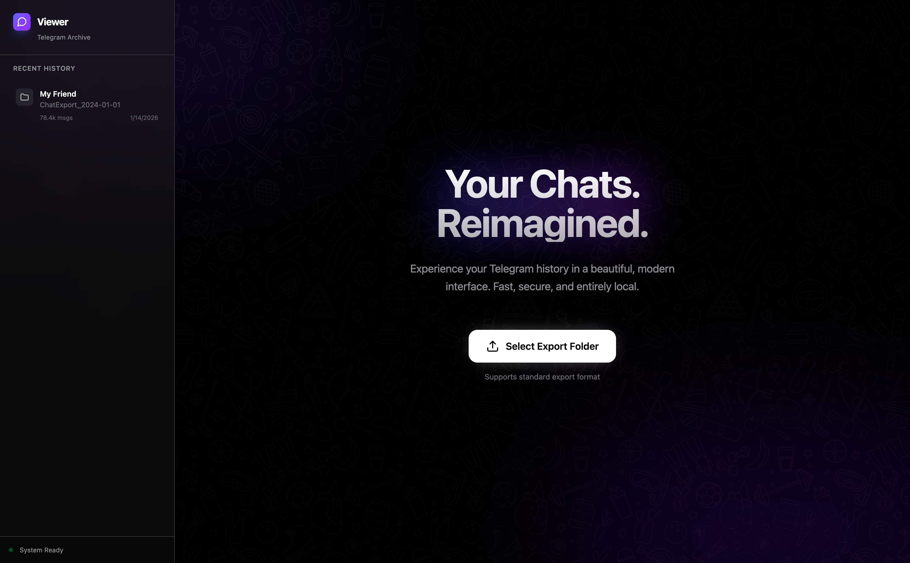
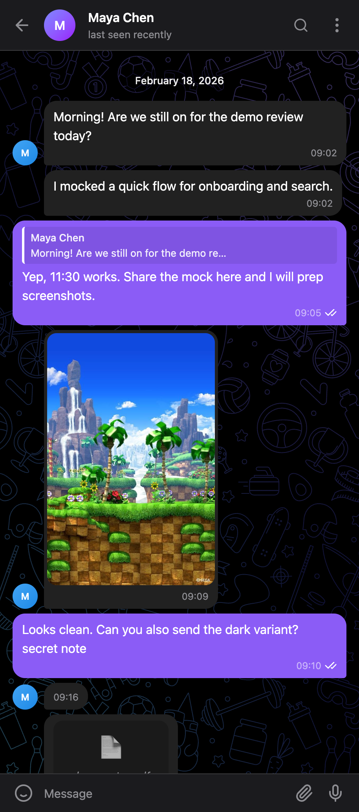
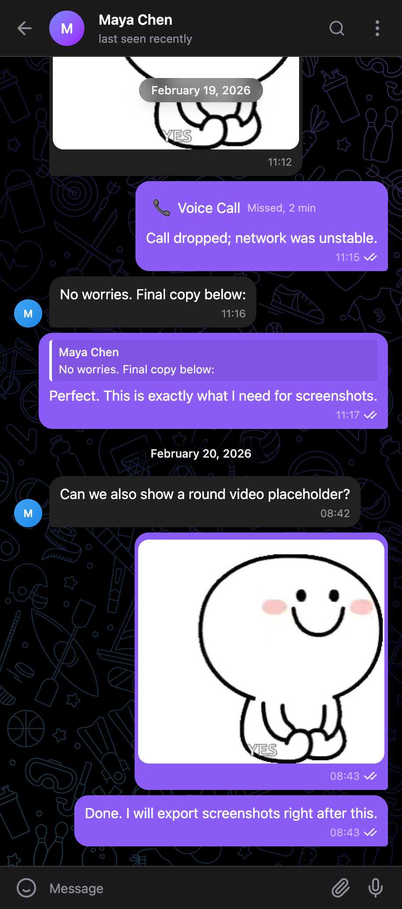

# Telegram Chat Viewer

A beautiful, private way to browse your Telegram chat history — entirely on your own device. No account needed, no data sent anywhere.



---

## What it does

Export any Telegram chat and open it here to read your messages in a clean, modern interface, just like the real app. Photos, stickers, voice messages, and more are all supported.

|                              |                                |
| :--------------------------: | :----------------------------: |
|  |  |

---

## Requirements

- [Node.js](https://nodejs.org/) (version 18 or newer — download the **LTS** version from the website)
- A Telegram chat export (instructions below)

---

## How to export a chat from Telegram

1. Open **Telegram Desktop** on your computer.
2. Open the chat you want to export.
3. Click the **⋮ (three dots)** menu in the top-right corner.
4. Select **Export Chat History**.
5. Choose the format **HTML** and select what media to include.
6. Click **Export** — Telegram will save a folder to your computer.

---

## How to run

**1. Download this project**

Click the green **Code** button at the top of this page, then choose **Download ZIP**. Unzip it anywhere you like.

**2. Open a terminal in the project folder**

- On **Mac**: Right-click the folder → *New Terminal at Folder*
- On **Windows**: Open the folder → click the address bar → type `cmd` → press Enter

**3. Install and start**

Paste these two commands one at a time and press Enter after each:

```
npm install
npm run dev
```

**4. Open the app**

Your browser will open automatically. If it doesn't, go to: [http://localhost:3000](http://localhost:3000)

**5. Select your export folder**

Click **Select Export Folder**, then pick the folder Telegram created during the export. Your chat will load instantly.

---

## Privacy

Everything runs locally on your machine. Your messages never leave your device.
